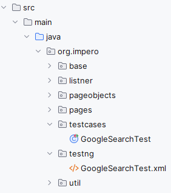
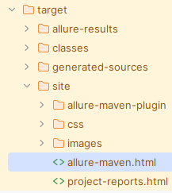

# Impero

## Technologies Used
* **Selenium** - Interact with the Web Elements in the WebPage
* **TestNG** - Execute Test Scenarios and do the Assertions
* **Allure** - Generate Test Report

## Test Execution
Open the project as a maven project and run one of the following files : 
* **src/main/java/org/impero/testcases/GoogleSearchTest.java**
* **src/main/java/org/impero/testng/GoogleSearchTest.xml**  

## Report Generation
Execute the maven site goal, so it will generate the report in the target folder.
Open allure-maven.html file in the browser to view the report :  
